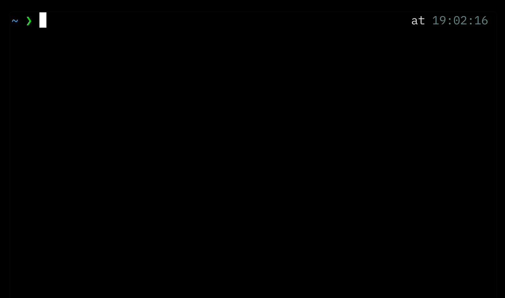

# Anchor


Anchor is a command-line tool for managing your anchors using a local SQLite database.



> **Yes, anchors are URLs.**

## Usage

This command installs the binary in your GOBIN directory (default: `~/go/bin`). It also creates a SQLite database file at a fixed location in your home directory: `~/.config/anchor/local.db`.

```bash
go install github.com/iamhectorsosa/anchor@latest
```

**Note:** This tool is currently implemented only for macOS (Darwin). Support for other operating systems has not been implemented yet.

Manage anchors with the same known patterns as aliases. Calling anchors automatically copies them to your system clipboard and opens them in your default browser. Anchor can import and export from/to CSV, supporting both local and remote paths/URLs for flexibility.

Here are some basic commands:


## Commands

Run the help command to get an updated list of all commands.


## Development

1. Clone the repository:

```bash
gh repo clone iamhectorsosa/anchor
cd anchor
```

2. Build the project:

```bash
CGO_ENABLED=1 go build -v -o anchor .
```
