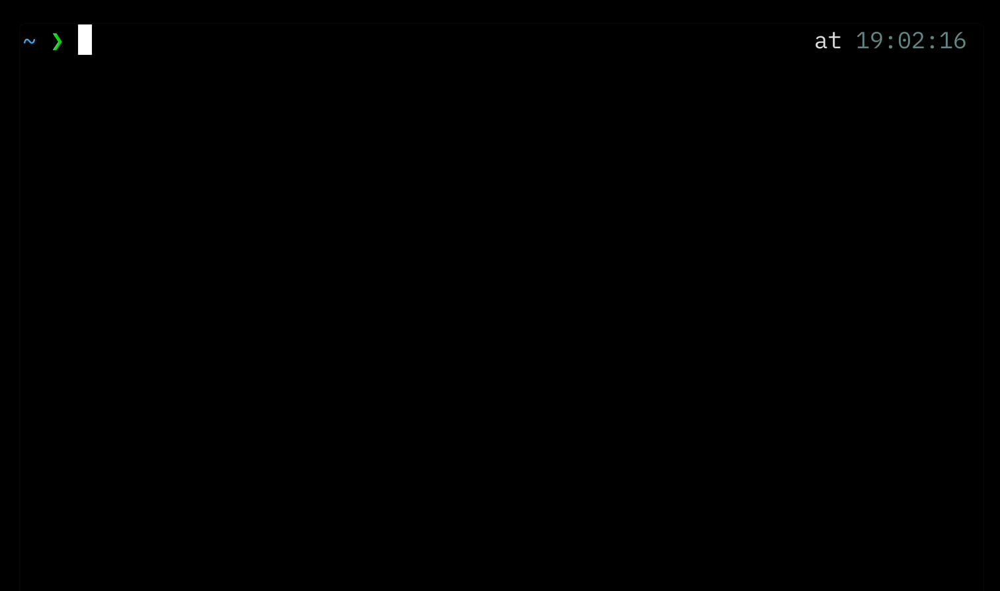

# Anchor


Anchor is a command-line tool for managing your anchors using a local SQLite database.



> **Yes, anchors are URLs.**

## Usage

This command installs the binary in your GOBIN directory (default: `~/go/bin`). It also creates a SQLite database file at a fixed location in your home directory: `~/.config/anchor/local.db`.

```bash
go install github.com/iamhectorsosa/anchor@latest
```

**Note:** This tool is currently implemented only for macOS (Darwin). Support for other operating systems has not been implemented yet.

Manage anchors with the same known patterns as aliases. Calling anchors automatically copies them to your system clipboard and opens them in your default browser. Anchor can import and export from/to CSV, supporting both local and remote paths/URLs for flexibility.

Here are some basic commands:

```bash
# Creates an anchor
❯ anchor [key='value']

# Calls an anchor
❯ anchor [key]

# Export anchors
❯ anchor export --path ~/

# Import anchors
❯ anchor import --url https://gist..

# List of anchors
❯ anchor ls
ANCHOR Found 5 anchors...
KEY       VALUE
gh        https://github.com/search?q=$1
mdn       https://developer.mozilla.org/en-US/search?q=$1
x         https://x.com/search?q=$1
youtube   https://www.youtube.com/results?search_query=$1
redit     https://www.reddit.com/search/?q=$1
```

## Commands

Run the help command to get an updated list of all commands.

```bash
❯ anchor help
Anchor is a CLI tool for managing your anchors.

To get an anchor, use: anchor [key] [...$1]
To add anchors, use: anchor [key='value']

Usage:
  anchor [key] [...$1] | [key='value'] [flags]
  anchor [command]

Available Commands:
  delete      Delete a anchor
  export      Export all anchors
  help        Help about any command
  import      Import anchors
  ls          List all anchors
  reset       Reset all anchors
  update      Update an anchor
```

## Development

1. Clone the repository:

```bash
gh repo clone iamhectorsosa/anchor
cd anchor
```

2. Build the project:

```bash
CGO_ENABLED=1 go build -v -o anchor .
```
